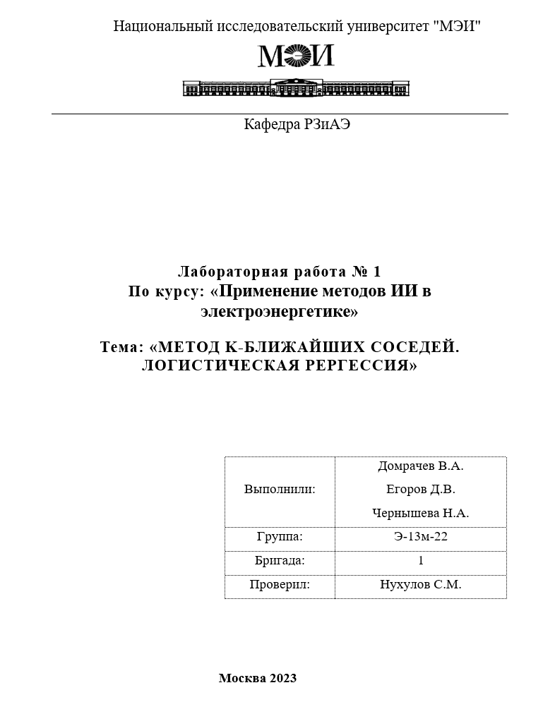

<h1 align="center">Исполнительный отчет</h1>

Цель лабораторной работы

    Получение практических навыков работы с метрическими и линейными моделями классификации и регрессии
 

Метод ближайших соседей KNeighborsClassifier

